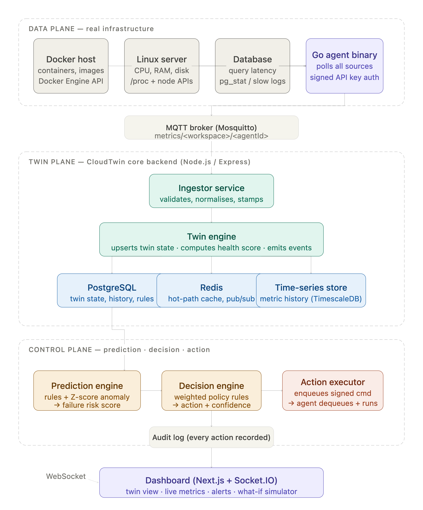

<div align="center">

# CloudTwin

</div>

<div align="center">

**Real-Time Digital Twin Platform for Containerized Infrastructure**

[](https://go.dev)
[](https://nodejs.org)
[](https://nextjs.org)
[](https://www.typescriptlang.org)
[](https://www.postgresql.org)
[](https://redis.io)
[](https://mosquitto.org)
[](https://docs.docker.com/engine/api)
[](LICENSE)

**[Report Bug](https://github.com/AaryanBairagi/CloudTwin/issues) · [Request Feature](https://github.com/AaryanBairagi/CloudTwin/issues)**

</div>

---

## Overview

CloudTwin creates a live virtual counterpart — a **digital twin** — for every Docker container running on a host. Each twin continuously mirrors its container's real-time state, computes a health score, predicts failure risk, and can autonomously propose and execute self-healing actions through a human-in-the-loop approval workflow.

Most observability tools stop at **Monitor → Alert**. CloudTwin implements a full closed loop:

```
Monitor → Predict → Decide → Act → Confirm
```

| Problem | CloudTwin's Solution |
|---|---|
| Reactive alerting | Rules engine evaluates sustained thresholds, creates alerts before users notice |
| Manual remediation | Decision engine proposes restarts; agent executes on approval |
| No trend awareness | What-if simulator projects metrics at increased load using historical slope |
| Opaque infrastructure | Health score (0–100) synthesises multiple metrics into a single readable signal |
| No accountability | Every alert, action, and ack is recorded with full lifecycle timestamps |
| Tight coupling | Agent-pull command pattern — backend never needs network access to target host |

---

## Architecture



The system is structured across three independent planes:

**Data plane** — A compiled Go binary runs on each monitored host. It polls the local Docker Engine API via Unix socket, builds metric snapshots, and publishes them to an MQTT broker every 10 seconds. The same binary runs a second goroutine that polls the backend for approved commands and executes them locally — the backend never reaches into the host directly.

**Twin plane** — A Node.js/Express backend subscribes to the MQTT topic, runs each incoming snapshot through the twin engine (health score computation, Postgres upsert, Redis-cached state), evaluates active rules, creates alerts, and proposes actions. The twin state is the virtual counterpart of the real container.

**Control plane** — The decision engine applies a cooldown-aware policy to propose restart actions. A human approves or rejects each proposal on the dashboard. Approved actions are pushed to a per-twin Redis queue; the agent polls, claims, and executes them, then acks the result. Every transition from `pending → approved → executing → completed` (or `failed`) is recorded.

---

## Tech Stack

### Agent

| Technology | Purpose |
|---|---|
| Go 1.26 | Compiled binary, two independent goroutines (metrics + commands) |
| Docker Engine API (Unix socket) | Container enumeration, stats streaming, `docker restart` |
| Paho MQTT (Go client) | Snapshot publishing to broker |
| Net/HTTP (stdlib) | Backend command polling and ack |

### Backend

| Technology | Version | Purpose |
|---|---|---|
| Node.js + Express | 5.2 | REST API, MQTT subscriber, request routing |
| `mqtt` (npm) | 5.15 | MQTT client — subscribes to `cloudtwin/snapshots` |
| `pg` (node-postgres) | 8.22 | PostgreSQL connection pool |
| `redis` (npm) | 6.0 | Per-twin command queues, hot-path caching |
| `dotenv` | 17.4 | Environment variable management |
| `cors` | 2.8 | Cross-origin configuration for the frontend |

### Frontend

| Technology | Version | Purpose |
|---|---|---|
| Next.js | 16.2 | React framework, App Router |
| React | 19.2 | UI rendering |
| TypeScript | 5 | Type-safe API contracts and component props |
| Tailwind CSS | 4 | Utility-first dark theme styling |
| Recharts | 3.9 | Metric visualisations |
| Lucide React | 1.21 | Icon system |

### Infrastructure

| Technology | Purpose |
|---|---|
| PostgreSQL 16 | Twin state, metric history, rules, alerts, actions |
| Redis 7 | Per-twin command queues (FIFO `LPUSH`/`RPOP`), hot-path cache |
| Mosquitto (MQTT) | Telemetry transport between agent and backend |
| Docker Compose | Local orchestration of all three infra services |

---

## System Design Decisions

### Agent-pull command execution

The backend never SSH-es or directly connects to a monitored host. Instead, it pushes approved commands to a Redis list keyed by twin ID (`commands:<twinId>`). The agent running on the host polls `GET /commands/claim` on its own interval, pops the command, executes it via the local Docker socket, and posts the result to `POST /commands/:id/ack`. This pattern:

- Eliminates the need for the backend to know host IPs or credentials
- Makes execution auditable — every claimed command transitions through `queued → executing → done/failed` in Postgres
- Matches how real fleet-management tools (Ansible, Teleport) handle remote execution

### Health score model

Rather than surfacing raw metrics, each twin carries a single `health_score` (0–100) computed as a weighted penalty against CPU and memory usage:

```
score = 100 - (cpu_penalty × 0.5) - (memory_penalty × 0.3)
```

Penalties scale linearly from 0 at the comfort zone to full weight at the danger threshold. This gives the dashboard a single sortable, scannable signal without losing the underlying metric detail.

### What-if simulation

The simulator fits a linear slope to the last 10 minutes of `metric_snapshots`, applies a user-selected load multiplier, and projects both CPU and memory 5 minutes forward:

```
projected = current × multiplier + slope × 300s
```

It returns a recommendation (`SAFE` / `MONITOR_CLOSELY` / `ADD_REPLICA`) and a `secondsToDanger` value so operators can make capacity decisions before load actually arrives.

### Decision engine cooldown

To prevent alert-storm spam in the actions queue, the decision engine checks for any non-terminal action for the same twin created within the last 10 minutes before proposing a new one. A flapping container that restarts every 30 seconds won't fill the queue with 20 pending proposals.

---

## Data Model

```
twins
├── twin_id          TEXT PK       container short ID (12-char)
├── name             TEXT          container name
├── status           TEXT          healthy | warning | critical | unknown
├── health_score     INTEGER       0–100 weighted penalty score
├── state            JSONB         latest raw snapshot from the agent
├── last_seen_at     TIMESTAMPTZ
└── updated_at       TIMESTAMPTZ

metric_snapshots
├── id               BIGSERIAL PK
├── twin_id          TEXT FK → twins
├── captured_at      TIMESTAMPTZ
├── cpu_percent      DOUBLE
├── memory_percent   DOUBLE
├── memory_mb        DOUBLE
└── payload          JSONB         full snapshot for future fields

rules
├── id               SERIAL PK
├── metric           TEXT          cpu | memory
├── operator         TEXT          > | >= | < | <=
├── threshold        DOUBLE
├── severity         TEXT          warning | critical
└── enabled          BOOLEAN

alerts
├── id               BIGSERIAL PK
├── twin_id          TEXT
├── rule_id          INTEGER FK → rules
├── metric           TEXT
├── current_value    DOUBLE
├── threshold        DOUBLE
├── severity         TEXT
├── message          TEXT
└── created_at       TIMESTAMPTZ

actions
├── id               BIGSERIAL PK
├── twin_id          TEXT FK → twins
├── alert_id         BIGINT FK → alerts
├── action_type      TEXT          restart (extensible)
├── reason           TEXT          human-readable rule that triggered proposal
├── status           TEXT          pending → approved → executing → completed | failed | rejected
├── approved_at      TIMESTAMPTZ
├── executed_at      TIMESTAMPTZ
├── completed_at     TIMESTAMPTZ
└── created_at       TIMESTAMPTZ
```

---

## Closed-Loop Flow

```
1. Agent publishes snapshot        cpu_percent: 95, memory_percent: 72
        │
        ▼
2. Backend ingest                  twin state upserted, health_score recomputed → 28 (critical)
        │
        ▼
3. Rules engine                    rule matched: cpu > 90 (severity: critical)
        │
        ▼
4. Alert created                   alerts row inserted, RETURNING id
        │
        ▼
5. Decision engine                 cooldown clear → INSERT INTO actions (status: pending)
        │
        ▼
6. Dashboard: ActionsPanel         human sees proposed RESTART for <twin_id>
        │
   ┌────┴────┐
Approve    Reject
   │
   ▼
7. POST /actions/:id/approve       action pushed to Redis: RPUSH commands:<twinId>
        │
        ▼
8. Agent command loop              GET /commands/claim → pops command, status → executing
        │
        ▼
9. docker restart <container>      Docker Engine API: POST /containers/:id/restart
        │
        ▼
10. POST /commands/:id/ack         { success: true } → status → completed, completed_at stamped
```

---

## API Reference

### Twins

| Method | Endpoint | Description |
|---|---|---|
| `GET` | `/twins` | All twins, current state |
| `GET` | `/twins/:id` | Single twin detail |
| `GET` | `/twins/:id/history` | Metric snapshot history |

### Alerts

| Method | Endpoint | Description |
|---|---|---|
| `GET` | `/alerts` | All alerts, most recent first |
| `GET` | `/alerts/:twinId` | Alerts for a specific twin |

### Actions

| Method | Endpoint | Description |
|---|---|---|
| `GET` | `/actions` | All actions, ordered by created_at DESC |
| `POST` | `/actions/:id/approve` | Approve — pushes to Redis queue |
| `POST` | `/actions/:id/reject` | Reject — terminal state, never queued |

### Commands (Agent-facing)

| Method | Endpoint | Description |
|---|---|---|
| `GET` | `/commands/claim?twinId=` | Pop one command from Redis, transition to executing |
| `POST` | `/commands/:id/ack` | Agent reports `{ success: boolean }`, closes the loop |

### Simulation

| Method | Endpoint | Description |
|---|---|---|
| `GET` | `/simulate/:twinId?loadMultiplier=2` | Project metrics at given load multiple |

---

## Running Locally

### Prerequisites

- Docker + Docker Compose
- Go 1.21+
- Node.js 18+

### 1. Start infrastructure services

```bash
cd infra
docker compose up -d
# Starts: Mosquitto (port 1883), PostgreSQL (port 5432), Redis (port 6379)
```

### 2. Apply schema and seed default rules

```bash
cd backend
npm install
node src/db/init.js
# Creates all tables and inserts 3 default rules:
#   cpu > 90  (critical)
#   memory > 85  (warning)
#   cpu > 75  (warning)
```

### 3. Start the backend

```bash
npm start
# Listening on http://localhost:4000
# Connects to Postgres, Redis, and MQTT on startup
```

### 4. Start the frontend

```bash
cd frontend
npm install
npm run dev
# Listening on http://localhost:3000
```

### 5. Start the agent

```bash
cd agent
go run main.go
# Connects to Docker socket, MQTT broker, and backend HTTP
# Metrics loop:  publishes every 10s
# Command loop:  polls every 5s
```

Open `http://localhost:3000`. Running containers appear as twin cards within one polling interval (~10 seconds).

### Environment variables

#### `backend/.env`

```env
PGHOST=localhost
PGPORT=5432
PGUSER=cloudtwin
PGPASSWORD=cloudtwin
PGDATABASE=cloudtwin
REDIS_URL=redis://localhost:6379
```

#### `frontend/.env.local`

```env
NEXT_PUBLIC_API_BASE=http://localhost:4000
```

---

## Project Structure

```
cloud-twin/
│
├── agent/                          Go agent binary
│   └── internal/
│       ├── collector/              Docker Engine API — list, stats, restart
│       ├── commands/               Poller — claim and ack over HTTP
│       ├── config/                 Config struct with sensible defaults
│       ├── publisher/              MQTT snapshot publisher
│       └── service/                Two goroutines: metrics loop + command loop
│
├── backend/
│   └── src/
│       ├── db/
│       │   ├── postgres.js         pg connection pool
│       │   ├── redis.js            Redis client, enqueue/dequeue helpers
│       │   ├── schema.sql          All table definitions and indexes
│       │   └── init.js             Schema apply + seed default rules
│       ├── routes/
│       │   ├── twins.js            GET /twins, GET /twins/:id, GET /twins/:id/history
│       │   ├── alerts.js           GET /alerts, GET /alerts/:twinId
│       │   ├── actions.js          GET + POST approve/reject
│       │   ├── commands.js         GET /claim, POST /ack  (agent-facing)
│       │   └── simulate.js         GET /simulate/:twinId
│       ├── rules/
│       │   ├── ruleEvaluator.js    Evaluates snapshot against active rules
│       │   ├── alertManager.js     Inserts alert rows, returns id
│       │   ├── decisionEngine.js   Cooldown check + propose restart
│       │   └── simulationEngine.js Linear slope extrapolation + recommendation
│       └── twin/
│           └── twinEngine.js       Health score, upsertTwin, saveSnapshot
│
├── frontend/
│   └── src/
│       ├── app/
│       │   ├── page.tsx            Main dashboard page
│       │   ├── layout.tsx          Root layout, fonts
│       │   └── globals.css         Design tokens, palette, pulse animations
│       ├── components/
│       │   ├── TwinCard.tsx        Per-container card with health gauge + metrics
│       │   ├── HealthGauge.tsx     270° arc gauge, score-coloured
│       │   ├── StatusDot.tsx       Animated pulse dot — speed reflects severity
│       │   ├── FleetSummary.tsx    Healthy / Warning / Critical counts in header
│       │   ├── MetricRow.tsx       Label + monospace value row
│       │   ├── ActionsPanel.tsx    Pending proposals with Approve / Reject buttons
│       │   └── WhatIfPanel.tsx     Load simulation UI with per-twin result cards
│       ├── lib/
│       │   ├── api.ts              All fetch calls — getTwins, getActions, simulateTwin …
│       │   ├── useTwins.ts         Polling hook, 5s interval, isMounted guard
│       │   └── timeAgo.ts          Relative timestamp formatter
│       └── types/
│           ├── twin.ts             Twin, Snapshot, HistoryPoint
│           ├── action.ts           Action, ActionStatus
│           └── simulation.ts       SimulationResult, SimulationRecommendation
│
└── infra/
    └── docker-compose.yml          Mosquitto + PostgreSQL + Redis
```

---

## Current Status and Known Tradeoffs

This is a complete, working demonstration of the full closed loop:

**collect → publish → ingest → score → evaluate → alert → propose → approve → queue → execute → ack**

| Feature | Status |
|---|---|
| Docker Engine API metric collection | ✅ Production-pattern |
| MQTT telemetry transport | ✅ Production-pattern |
| Twin engine with health score | ✅ Implemented |
| PostgreSQL time-series metric history | ✅ Implemented |
| Rules-based alert engine | ✅ Implemented |
| Decision engine with cooldown guard | ✅ Implemented |
| Redis per-twin command queue (FIFO) | ✅ Implemented |
| Agent-pull command execution | ✅ Implemented |
| Full action lifecycle audit trail | ✅ Implemented |
| What-if load simulation | ✅ Implemented |
| Dashboard with live polling | ✅ Implemented |
| Actions approval UI | ✅ Implemented |
| WebSocket live push (no polling lag) | ❌ Polling every 5s (sufficient for demo) |
| Kubernetes workload support | ❌ Docker only — K8s agent is planned |
| ML-based anomaly detection | ❌ Rule thresholds only — planned extension |
| Multi-tenant workspace isolation | ❌ Single-tenant by design |
| Persistent Redis (AOF/RDB) | ❌ In-memory only — queue clears on restart |

---

## Planned Extensions

- [ ] **Kubernetes agent** — watch Pod resources via K8s API, `kubectl rollout restart` as the action type
- [ ] **ML anomaly detection** — Isolation Forest model per twin, replaces fixed threshold rules with learned baselines
- [ ] **WebSocket live push** — Redis pub/sub → `ws` broadcaster, eliminates dashboard polling lag
- [ ] **Multi-tenant workspaces** — workspace-scoped twins, rules, and actions for SaaS deployment
- [ ] **Scale-replica action** — `docker compose up --scale` as a second action type alongside restart
- [ ] **Cloud deployment** — agent as a DaemonSet sidecar, backend on managed container hosting

---

## License

MIT — see [LICENSE](./LICENSE).

Built as a portfolio demonstration of distributed systems, observability patterns, and DevOps automation concepts.

---

<div align="center">
  <sub>Built by <a href="https://github.com/AaryanBairagi">Aaryan Bairagi</a></sub>
</div>
